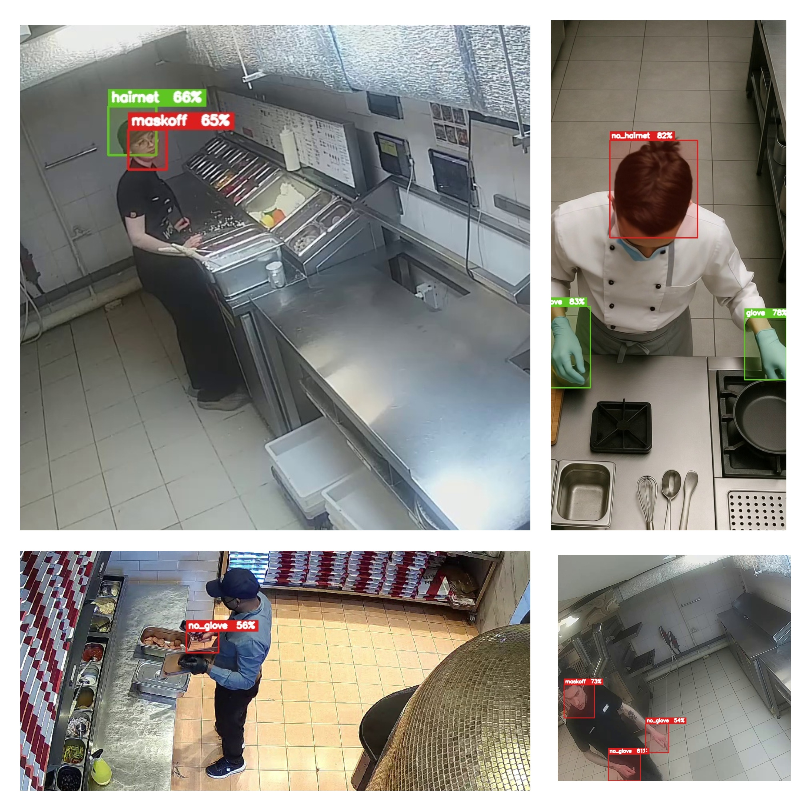

# 🦺 Kitchen PPE Compliance Detection System

An AI-powered real-time PPE (Personal Protective Equipment) compliance monitoring system designed for kitchen and food safety environments using YOLOv8 and Computer Vision.

The system detects and tracks PPE violations such as missing masks, gloves, and hairnets to help improve workplace hygiene, safety, and compliance monitoring.

---

# 🚀 Features

- 🎥 Real-time PPE detection
- 🧠 YOLOv8-based object detection
- 👥 Person counting & tracking
- ⚠️ Violation detection and monitoring
- 📦 Bounding boxes with live labels
- 📊 Real-time compliance statistics
- ⚡ Optimized for live inference
- 📤 ONNX model export support

---

# 🛠️ Technologies Used

- Python
- YOLOv8
- OpenCV
- Computer Vision
- NumPy
- ONNX
- Roboflow Dataset
- Deep Learning

---

# 📂 Detected Classes

- ✅ mask
- ✅ glove
- ✅ hairnet
- ❌ maskoff
- ❌ no_glove
- ❌ no_hairnet

---

# 📊 Dataset Information

The model was trained using the Roboflow **“dd”** object detection dataset.

### Dataset Statistics

- Total Images: **3,521**
- Training Images: **2,567**
- Validation Images: **614**
- Test Images: **340**

---

# 📦 Installation

## 1️⃣ Clone the Repository

```bash
git clone https://github.com/YOUR_USERNAME/kitchen-ppe-compliance.git
cd kitchen-ppe-compliance
```

## 2️⃣ Install Dependencies

```bash
pip install -r requirements.txt
```

---

# 📁 Dataset Structure

Place the dataset inside the following structure:

```bash
dataset/
├── train/
│   ├── images/
│   └── labels/
│
├── valid/
│   ├── images/
│   └── labels/
│
└── test/
    ├── images/
    └── labels/
```

---

# 🏋️ Model Training

Run the training script:

```bash
python train.py
```

### Training Pipeline Includes

- Dataset configuration generation
- YOLOv8 model training
- Best weight checkpoint saving
- ONNX export for deployment
- Hyperparameter optimization
- Early stopping support

---

# ▶️ Real-Time Inference

Run the detection system:

```bash
python inference.py
```

### Inference Features

- Live webcam monitoring
- Real-time PPE detection
- Violation counting
- Bounding box visualization
- Compliance statistics output

---

# 🎥 Using Video Files

To process a video file instead of a webcam, modify:

```python
cap = cv2.VideoCapture(0)
```

to:

```python
cap = cv2.VideoCapture("video.mp4")
```

---

# ⚡ Model Performance

The model is optimized for efficient real-time performance.

### Configuration

- Image Size: `640x640`
- Batch Size: `16`
- Real-Time Inference Optimized
- Automatic Hyperparameter Tuning
- ONNX Deployment Support

---

# 🧩 Future Improvements

- Multi-camera support
- PPE compliance analytics dashboard
- Email/WhatsApp alert system
- Employee tracking integration
- Cloud deployment
- Edge AI optimization

---

# 📜 License

This project is licensed under the MIT License.
---

# 📸 Demo

<p align="center">
  
</p>
---

# 🤝 Contributions

Contributions, improvements, and suggestions are welcome.

Feel free to fork the repository and submit a pull request.